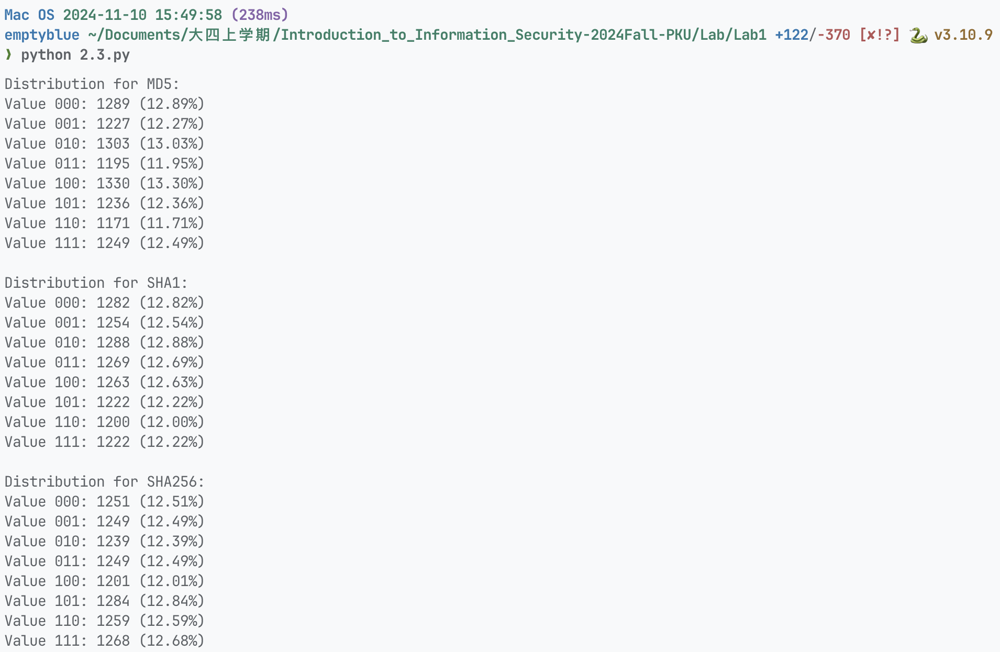

# 信息安全引论实验报告 01

<center><div style='height:2mm;'></div><div style="font-size:10pt;">梁昱桐 2100013116</div></center>

<center><div style='height:2mm;'></div><div style="font-size:10pt;">2024.11.10</div></center>

## 密钥加解密实验

### 使用不同加密算法进行加密


### 学习 ECB 与 CBC 的区别

#### ECB 模式和 CBC 模式

**ECB模式**：每个分组独立加密，不依赖其他分组。这意味着如果两个相同的明文分组被加密，它们的密文也将相同。因此，图像的相似区域会产生相同的密文模式，导致加密后的图像依然保留原图的某些模式。

**CBC模式**：每个分组的加密依赖于前一个分组的密文，并且需要一个初始化向量（IV）。这使得即使相同的明文分组也会产生不同的密文，消除了图像中的模式，使加密后的图像看起来更加随机。

#### 实验结果

1. **ECB模式加密结果**：由于ECB模式无法隐藏图像的重复模式，许多图像特征仍然可以在加密后的图像中看到。你会发现图像中的块状结构仍然存在。

   

2. **CBC模式加密结果**：CBC模式会将图像加密为完全随机的噪声，原始图像的任何模式都无法在加密后的图像中看到。

   

#### 结果分析

- **ECB模式的缺陷**：ECB模式的安全性较差，尤其对于图像和其他有明显模式的数据，加密后的输出依然可能暴露原始数据的某些特征。
- **CBC模式的优势**：由于每个分组的加密依赖于前一个分组的密文，CBC模式能够有效地隐藏输入数据的模式，使得加密后的图像看起来像是随机数据。

### 损坏的密文


从输出中可以看到，修改后的 ECB 密文解密后，只有一部分内容被破坏，其余部分依然能正常解密：

```bash
Decrypted (ECB) after modification:
i love pkuhahah
=4kԁTx܇SYi love pkuhahah
i love pkuhahah
i love pkuhahah
```

从输出中可以看到，修改后的 CBC 密文解密后，不仅当前块被破坏，紧接着的块也出现了问题：

```bash
Decrypted (CBC) after modification:
i love pkuhahah
lxһqLա?i love pkuhahh # 少了一个 a
i love pkuhahah
i love pkuhahah
```

### 密文的填充


#### 密文长度和填充分析

AES算法的块大小是固定的16字节，因此加密时，如果明文的长度不是16字节的倍数，就需要进行填充（Padding）。

从输出结果来看，无论是ECB模式还是CBC模式，密文长度都大于或等于明文长度，且密文长度是16字节的倍数。这说明加密时使用了填充。

从输出中可以看到：

- `Plaintext: Short text`（长度不足16字节）对应的密文长度为24字节。
- `Plaintext: Sixteen bytestxt`（恰好16字节）对应的密文长度为44字节。
- `Plaintext: This text is longer than sixteen bytes.`（大于16字节）对应的密文长度为64字节。

这表明每次加密操作都进行了填充，使明文长度变为16字节的整数倍。

#### 代码中的填充实现:

在`EncryptDataCBC`和`EncryptDataECB`类的`pad`函数中，填充是通过以下代码实现的：

```python
def pad(self, text):
    """
    填充函数, 使被加密数据的字节码长度是block_size的整数倍
    """
    count = len(text.encode('utf-8'))
    add = self.length - (count % self.length)
    entext = text + (chr(add) * add)
    return entext
```

这个函数的作用是：
1. 计算明文的字节长度 `count`。
2. 计算需要填充的字节数 `add`，使明文长度达到16字节的整数倍。
3. 将填充的字符（填充字符的ASCII值等于需要填充的字节数）追加到明文末尾。

#### 解密时去除填充

解密后的数据会包含填充的字符，因此需要在解密后去除这些填充。在代码中，通过`self.unpad`函数实现去除填充：

```python
self.unpad = lambda s: s[0:-s[-1]]
```

这个函数的作用是：
- 根据最后一个字节的值，去掉相应数量的填充字符。

## 单向哈希函数与 MAC 实验

### 生成消息摘要和 MAC


### Keyed Hash 和 HMAC


### 单向哈希函数的随机性



通过生成大量的随机数并提取其低3位，可以观察到每个3位二进制数的分布。理论上，低3位可能的值（000 到 111）应该是均匀分布的，每种组合的概率应接近 12.5%，但由于随机性的原因，实际的分布会有一些波动。

### 单向特性

#### 实验结果

```bash
python 2.4.py
[1] MD5
[2] SHA1
[3] SHA256
请选择模式: 请输入随机数种子: 请输入时间限制（秒）: 按回车开始找到   1 个前导零, MD5(746573747365656431) = 505482937e80082c923b67c53b06b549
花费时间: 0.00 秒
找到   2 个前导零, MD5(505482937e80082c923b67c53b06b549) = 2c1febce4e1bf79e7015823c9966d7d1
花费时间: 0.00 秒
找到   4 个前导零, MD5(ee86c6f099ba15b1407dcdd80000624d) = 085262018df0cde92a8e854f76d36b30
花费时间: 0.00 秒
找到   6 个前导零, MD5(d56c7f30fc090c1295730d9666922ba0) = 03605ad24ae5af6ca5a44735b1abb66b
花费时间: 0.00 秒
找到   7 个前导零, MD5(85cd288d397f8c21560255c002c1b85e) = 019f3c010220cbc079c0de20ca6cf717
花费时间: 0.00 秒
找到  10 个前导零, MD5(2710cef0b0832beb2eba6e0cee2a67b3) = 002303ec02eb241d97b8d50c8a984dda
花费时间: 0.00 秒
找到  11 个前导零, MD5(e9c65a66cf6152caa58a89196c2e90e5) = 0017585e198796ce18894147ca456618
花费时间: 0.02 秒
找到  12 个前导零, MD5(082cd48a319ef2e6415bb56a3898598a) = 000db0557e2bb510a8c35b808ccc1f58
花费时间: 0.02 秒
找到  14 个前导零, MD5(cb19ba7106a067b46717732e759edce9) = 00022117e467cb5ae40c86b989aca2e1
花费时间: 0.03 秒
找到  16 个前导零, MD5(d787e6827b3a11901333ef66d16bc147) = 000093e2375d658219ef2c05b2c28f89
花费时间: 0.16 秒
找到  19 个前导零, MD5(32849810818f4fedf01d4c73836f68c6) = 0000177c9a22a6b5ee1c4b2f10752076
花费时间: 0.77 秒
时间限制已到，退出
[1] MD5
[2] SHA1
[3] SHA256
请选择模式: 请输入随机数种子: 请输入时间限制（秒）: 按回车开始找到   3 个前导零, SHA1(840f119784bea36bbd420dc960ceb56943cd55b0) = 19acafa0441316a9a4583ad53c1709be6de13a60
花费时间: 0.00 秒
找到   5 个前导零, SHA1(4f8124043127ec46cdd3d3a2097a6ec544a9717e) = 0653408bdb48d3bd99c1cb59ab860cbaf843d408
花费时间: 0.00 秒
找到   8 个前导零, SHA1(d22a3356974004c8b7f21dcb81ad8d796fc3c8d8) = 00d41e36e6ded569cde289e1613d1f0c35dfb63e
花费时间: 0.00 秒
找到   9 个前导零, SHA1(e300df7cb1ae438d48f42e87f1f3239cee18f97d) = 0053620537e7864ca90321904b063b6e86aad225
花费时间: 0.00 秒
找到  10 个前导零, SHA1(19e6b22478b8bf7a6bd6528e96f1bbc0fcf83adf) = 00232533e899e7d9b2b8546d323f6cd34a1d6bf1
花费时间: 0.02 秒
找到  11 个前导零, SHA1(8dd7455d0f1837495825c76185366522ef84c21c) = 0017d34cd793761eddb91efca2d1602c7ba91950
花费时间: 0.03 秒
找到  15 个前导零, SHA1(e52f8d3ecace4fd8311ee3895d4753d1ac90505b) = 0001bc6a1131c62f4d04d49d56945cce31d315c6
花费时间: 0.04 秒
找到  16 个前导零, SHA1(cde517ad507dbb37111fb020cc93ee178fa1310a) = 0000c30305a1cda166ca306f8ae06a14fca8debc
花费时间: 0.14 秒
找到  18 个前导零, SHA1(abe2fd2456f0c54e6b764edeec6eab6e210c26b0) = 00002527bb386965844c575e19f36bb99957794d
花费时间: 0.19 秒
找到  19 个前导零, SHA1(2f7e5db8ff3abd915f3339f3cc4d41fb74114f5b) = 00001f6e6d1a08472b0ce67099f9fd03d07d6c1c
花费时间: 2.04 秒
时间限制已到，退出
[1] MD5
[2] SHA1
[3] SHA256
请选择模式: 请输入随机数种子: 请输入时间限制（秒）: 按回车开始找到   3 个前导零, SHA256(d6bac5809672675bb1700a2ac7c0d2d9a4773984bb5323ed4b5a09c2d9f3acae) = 168a264400496d9d38b9f1e36e4a0d08312d7c353b124d97e6a9300d055e5427
花费时间: 0.00 秒
找到   9 个前导零, SHA256(15d890425746e34e141ae2c6366b1fa08937ed4aa3af75e806b4b56ad502bc2a) = 00679ef82fc9e01fdfb0cc08f39268391f91264b7890b1899bb4fa13cd168cb2
花费时间: 0.00 秒
找到  11 个前导零, SHA256(71ae84e8ec34667360761fa8e0c7de9083d9501fc66dcda6e70e8f7f1d3960ea) = 001252fbff99efea2de075d3edb48adf3eb909eada77dd5cc8bf3356ec880fd3
花费时间: 0.00 秒
找到  13 个前导零, SHA256(357d1f01dff418d8039188f59a9aceefdeffae9bebf4348dd49689bafa6b5032) = 000497d01684ddeeae76da7ffe4152d427b48febc7cb2f7c9c60d06089ef1543
花费时间: 0.05 秒
找到  15 个前导零, SHA256(f6472ee3c44a6f3e2f263b7fc375ecf6943f2779f6eee2a7d487fda72d434d12) = 000169559071f9d18d14a83b3097b60569f5184b7667196023122b21dbf0be4b
花费时间: 0.12 秒
找到  17 个前导零, SHA256(cd5bd7e57826e5a390439dbe8bcabae15be2dcf8373d7c9984a70a39b7859d33) = 00007b965130189533c86791de2c7810175ce4a8260df57c496d5cbca149604c
花费时间: 0.15 秒
找到  19 个前导零, SHA256(58dac20a93bd48678d1628f3eaeec36a3bf92f2f1c5c90328ad37aab3bfc58c5) = 00001e3934866ef65b8e366886f53dc6ece464c818029052b7c2c9e76c7009e2
花费时间: 0.34 秒
时间限制已到，退出
```

#### 实验结果分析

1. 前导零数量与时间成正比关系：在10秒内，程序找到了1至4个前导零。随着前导零数量的增加，找到符合条件的哈希值的难度呈指数级增加。
2. MD5 的效率较高：MD5 哈希算法在计算速度上非常快，相比之下，SHA1 和 SHA256 的哈希计算速度较慢，可能在相同时间限制下找到的前导零更少。
3. 种子选择的重要性：不同的种子会导致不同的哈希结果。种子的选择会影响哈希计算的初始状态，从而影响找到前导零的速度。
4. 时间限制的影响显著：如果希望找到更多的前导零，可能需要增加时间限制。前导零的数量与时间成正相关，但找到更多前导零的难度增加较快。